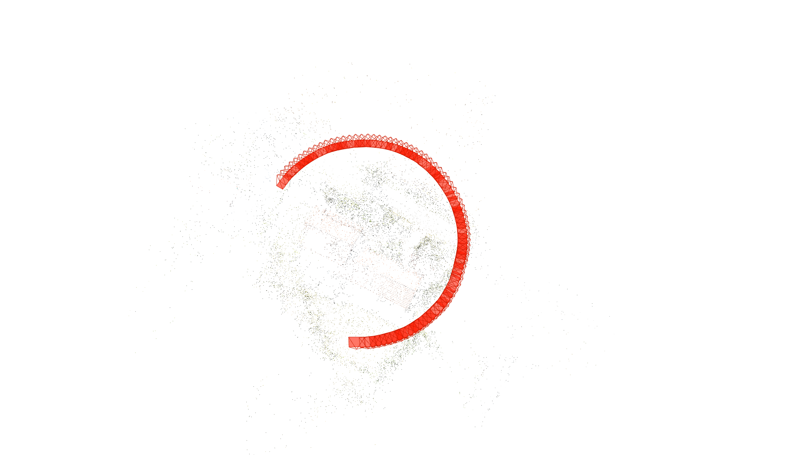
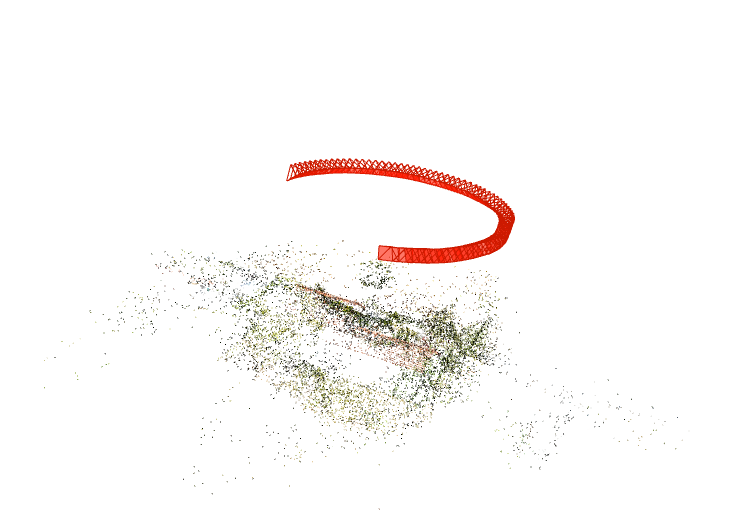
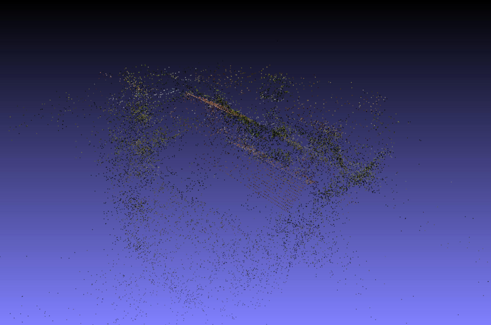
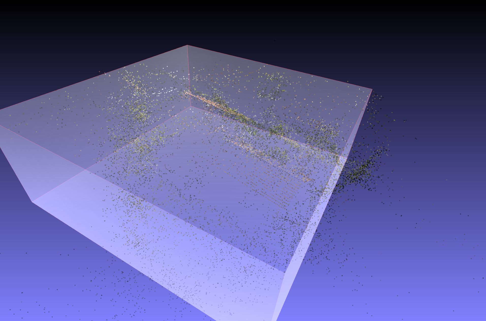
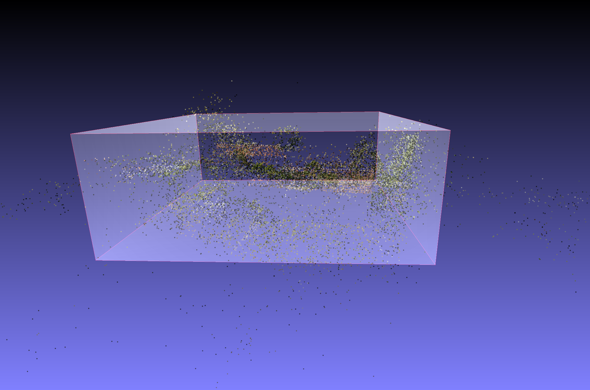
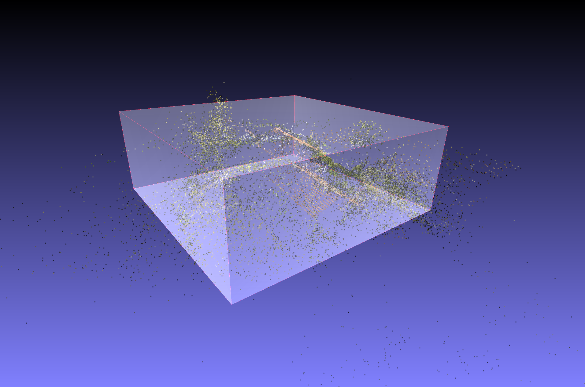
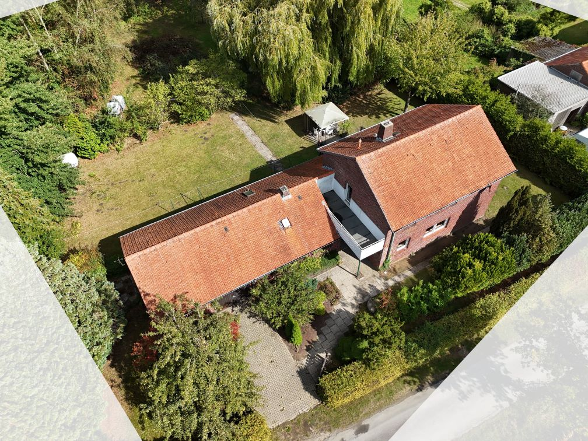
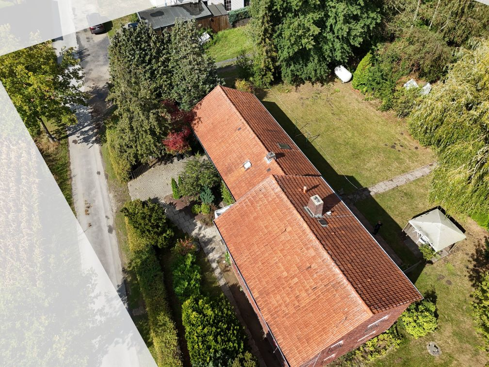

# Additions
## AWS
- storage mount: `/dev/sdb`
- chosen AMI needs:
  - docker-buildx update 
  `curl -SL https://github.com/docker/buildx/releases/download/v0.30.1/buildx-v0.30.1.linux-amd64 -o ~/.docker/cli-plugins/buildx-v0.30.1.linux-amd64`
  - docker compose update 
  `curl -SL https://github.com/docker/compose/releases/latest/download/docker-compose-linux-x86_64 -o ~/.docker/cli-plugins/docker-compose`
- TMP and Build Dir changes: 

## Colmap 
Colmap may create multiple models depending on the complexity of the scene. This can be fixed simply by selecting the biggest model reconstructed. A better appraoch should be found in future work

## Hydra Conf
Allows for easy configuration via a json file. It allows setting via command as well and provides functionality to run multiple runs at once with different configurations. The latter helps for quality benchmarking. 

## Pipeline 
### First Stage (Precursor - *A rough search*)
The first stage uses [COLMAP](https://github.com/colmap/colmap) with regular and super fast features - SIFT - and spatial matching, which exploits positional GPS information in the meta data to match image features efficiently. This run executes in 1-2mins.

### The intermediate
The model from Stage 1 gives us the ability to know which areas in the images actually represent our Region of Interest (ROI). 
From the tutorial for drone footage capturing we know that the images are captured circuling the ROI. 
Knowing the rough camera poisitions we construct the best fitting circle describing the flight path using PCA and assume our object lies within that circle. From this we get a plane fitted in 3D. A further ransac approach gives us the circle on that plane. 
We take the center of that circle and construct a convex hull arround all cameras. We then calculate the distance from the outer edge of the hull or all cameras positions to the circle center found by ransac and take the upper 90th percentile as a robust hull radius. To balance even further and to get the bigger picture of the flight path instead of just the outer camera poisitions we average with the radius from the PCA approach above. 
To get a bounding box in 3d, we further need to estimate the height of our object - `_calculate_robust_heights`

**Geo masking**
Given the bounding box, we can then project such box into the camera view of each reconstructed camera. With some view frustum limiting this gets us a mask that describes per image, what is inbound and what is outbound (not considered in Stage 2). 

Example: 

<div style="display: flex; gap: 20px;">
  <div style="flex: 1;">
    
  </div>
  <div style="flex: 1;">
    
  </div>
</div>
<p style="text-align: center; font-size: 0.9em; color: #666;">Top view (left) and side view (right) of the flight path</p>

<div style="display: grid; grid-template-columns: 1fr 1fr; gap: 20px;">
  <div>
    
  </div>
  <div>
    
  </div>
  <div>
    
  </div>
  <div>
    
  </div>
</div>
<p style="text-align: center; font-size: 0.9em; color: #666;">3D bounding box, points outside will be excluded by image mask</p>

<div style="display: flex; gap: 20px;">
  <div style="flex: 1;">
    
  </div>
  <div style="flex: 1;">
    
  </div>
</div>
<p style="text-align: center; font-size: 0.9em; color: #666;">3D bounding box projected into image space</p>


### Second STage (Fine Reconstruction - *Exploiting*)


# hloc - the hierarchical localization toolbox

This is `hloc`, a modular toolbox for state-of-the-art 6-DoF visual localization. It implements [Hierarchical Localization](https://arxiv.org/abs/1812.03506), leveraging image retrieval and feature matching, and is fast, accurate, and scalable. This codebase combines and makes easily accessible years of research on image matching and Structure-from-Motion.

With `hloc`, you can:

- Reproduce state-of-the-art results on multiple indoor and outdoor visual localization benchmarks
- Run Structure-from-Motion with SuperPoint+SuperGlue to localize with your own datasets
- Evaluate your own local features or image retrieval for visual localization
- Implement new localization pipelines and debug them easily 🔥

<p align="center">
  <a href="https://arxiv.org/abs/1812.03506"></a>
  <br /><em>Hierachical Localization uses both image retrieval and feature matching</em>
</p>

##

## Quick start ➡️ [](https://colab.research.google.com/drive/1Eqoz-uLTCGeEWtH95FZyVs2vI-qkTOWr)

Build 3D maps with Structure-from-Motion and localize any Internet image right from your browser! **You can now run `hloc` and COLMAP in Google Colab with GPU for free.** The notebook [`demo.ipynb`](https://colab.research.google.com/drive/1Eqoz-uLTCGeEWtH95FZyVs2vI-qkTOWr) shows how to run SfM and localization in just a few steps. Try it with your own data and let us know!

## Installation

`hloc` requires Python >=3.7 and PyTorch >=1.1. Installing the package locally pulls the other dependencies:

```bash
git clone --recursive https://github.com/cvg/Hierarchical-Localization/
cd Hierarchical-Localization/
python -m pip install -e .
```

All dependencies are listed in `requirements.txt`. **Starting with `hloc-v1.3`, installing COLMAP is not required anymore.** This repository includes external local features as git submodules – don't forget to pull submodules with `git submodule update --init --recursive`.

We also provide a Docker image:
```bash
docker build -t hloc:latest .
docker run -it --rm -p 8888:8888 hloc:latest  # for GPU support, add `--runtime=nvidia`
jupyter notebook --ip 0.0.0.0 --port 8888 --no-browser --allow-root
```

## General pipeline

The toolbox is composed of scripts, which roughly perform the following steps:

1. Extract local features, like [SuperPoint](https://arxiv.org/abs/1712.07629) or [DISK](https://arxiv.org/abs/2006.13566), for all database and query images
2. Build a reference 3D SfM model
   1. Find covisible database images, with retrieval or a prior SfM model
   2. Match these database pairs with [SuperGlue](https://psarlin.com/superglue/) or the faster [LightGlue](https://github.com/cvg/LightGlue)
   3. Triangulate a new SfM model with COLMAP
3. Find database images relevant to each query, using retrieval
4. Match the query images
5. Run the localization
6. Visualize and debug

The localization can then be evaluated on [visuallocalization.net](https://www.visuallocalization.net/) for the supported datasets. When 3D Lidar scans are available, such as for the indoor dataset InLoc, step 2. can be skipped.

Strcture of the toolbox:

- `hloc/*.py` : top-level scripts
- `hloc/extractors/` : interfaces for feature extractors
- `hloc/matchers/` : interfaces for feature matchers
- `hloc/pipelines/` : entire pipelines for multiple datasets

`hloc` can be imported as an external package with `import hloc` or called from the command line with:
```bash
python -m hloc.name_of_script --arg1 --arg2
```

## Tasks

We provide step-by-step guides to localize with Aachen, InLoc, and to generate reference poses for your own data using SfM. Just download the datasets and you're reading to go!

### Aachen – outdoor localization

Have a look at [`pipeline_Aachen.ipynb`](https://nbviewer.jupyter.org/github/cvg/Hierarchical-Localization/blob/master/pipeline_Aachen.ipynb) for a step-by-step guide on localizing with Aachen. Play with the visualization, try new local features or matcher, and have fun! Don't like notebooks? You can also run all scripts from the command line.

<p align="center">
  <a href="https://nbviewer.jupyter.org/github/cvg/Hierarchical-Localization/blob/master/pipeline_Aachen.ipynb"></a>
</p>

### InLoc – indoor localization

The notebook [`pipeline_InLoc.ipynb`](https://nbviewer.jupyter.org/github/cvg/Hierarchical-Localization/blob/master/pipeline_InLoc.ipynb) shows the steps for localizing with InLoc. It's much simpler since a 3D SfM model is not needed.

<p align="center">
  <a href="https://nbviewer.jupyter.org/github/cvg/Hierarchical-Localization/blob/master/pipeline_InLoc.ipynb"></a>
</p>

### SfM reconstruction from scratch

We show in [`pipeline_SfM.ipynb`](https://nbviewer.jupyter.org/github/cvg/Hierarchical-Localization/blob/master/pipeline_SfM.ipynb) how to run 3D reconstruction for an unordered set of images. This generates reference poses, and a nice sparse 3D model suitable for localization with the same pipeline as Aachen.

## Results

- Supported local feature extractors: [SuperPoint](https://arxiv.org/abs/1712.07629), [DISK](https://arxiv.org/abs/2006.13566), [D2-Net](https://arxiv.org/abs/1905.03561), [SIFT](https://www.cs.ubc.ca/~lowe/papers/ijcv04.pdf), and [R2D2](https://arxiv.org/abs/1906.06195).
- Supported feature matchers: [SuperGlue](https://arxiv.org/abs/1911.11763), its faster follow-up [LightGlue](https://github.com/cvg/LightGlue), and nearest neighbor search with ratio test, distance test, and/or mutual check. hloc also supports dense matching with [LoFTR](https://github.com/zju3dv/LoFTR).
- Supported image retrieval: [NetVLAD](https://arxiv.org/abs/1511.07247), [AP-GeM/DIR](https://github.com/naver/deep-image-retrieval), [OpenIBL](https://github.com/yxgeee/OpenIBL), and [MegaLoc](https://github.com/gmberton/MegaLoc).

Using NetVLAD for retrieval, we obtain the following best results:

| Methods                                                      | Aachen day         | Aachen night       | Retrieval      |
| ------------------------------------------------------------ | ------------------ | ------------------ | -------------- |
| [SuperPoint + SuperGlue](https://www.visuallocalization.net/details/10931/) | 89.6 / 95.4 / 98.8 | 86.7 / 93.9 / 100  | NetVLAD top 50 |
| [SuperPoint + NN](https://www.visuallocalization.net/details/10866/) | 85.4 / 93.3 / 97.2 | 75.5 / 86.7 / 92.9 | NetVLAD top 30 |
| D2Net (SS) + NN                                              | 84.6 / 91.4 / 97.1 | 83.7 / 90.8 / 100  | NetVLAD top 30 |

| Methods                                                      | InLoc DUC1         | InLoc DUC2         | Retrieval      |
| ------------------------------------------------------------ | ------------------ | ------------------ | -------------- |
| [SuperPoint + SuperGlue](https://www.visuallocalization.net/details/10936/) | 46.5 / 65.7 / 78.3 | 52.7 / 72.5 / 79.4 | NetVLAD top 40 |
| [SuperPoint + SuperGlue (temporal)](https://www.visuallocalization.net/details/10937/) | 49.0 / 68.7 / 80.8 | 53.4 / 77.1 / 82.4 | NetVLAD top 40 |
| [SuperPoint + NN](https://www.visuallocalization.net/details/10896/) | 39.9 / 55.6 / 67.2 | 37.4 / 57.3 / 70.2 | NetVLAD top 20 |
| D2Net (SS) + NN                                              | 39.9 / 57.6 / 67.2 | 36.6 / 53.4 / 61.8 | NetVLAD top 20 |

Check out [visuallocalization.net/benchmark](https://www.visuallocalization.net/benchmark) for more details and additional baselines.

## Supported datasets

We provide in [`hloc/pipelines/`](./hloc/pipelines) scripts to run the reconstruction and the localization on the following datasets: Aachen Day-Night (v1.0 and v1.1), InLoc, Extended CMU Seasons, RobotCar Seasons, 4Seasons, Cambridge Landmarks, and 7-Scenes. For example, after downloading the dataset [with the instructions given here](./hloc/pipelines/Aachen#installation), we can run the Aachen Day-Night pipeline with SuperPoint+SuperGlue using the command:
```bash
python -m hloc.pipelines.Aachen.pipeline [--outputs ./outputs/aachen]
```

## BibTex Citation

If you report any of the above results in a publication, or use any of the tools provided here, please consider citing both [Hierarchical Localization](https://arxiv.org/abs/1812.03506) and [SuperGlue](https://arxiv.org/abs/1911.11763) papers:

```
@inproceedings{sarlin2019coarse,
  title     = {From Coarse to Fine: Robust Hierarchical Localization at Large Scale},
  author    = {Paul-Edouard Sarlin and
               Cesar Cadena and
               Roland Siegwart and
               Marcin Dymczyk},
  booktitle = {CVPR},
  year      = {2019}
}

@inproceedings{sarlin2020superglue,
  title     = {{SuperGlue}: Learning Feature Matching with Graph Neural Networks},
  author    = {Paul-Edouard Sarlin and
               Daniel DeTone and
               Tomasz Malisiewicz and
               Andrew Rabinovich},
  booktitle = {CVPR},
  year      = {2020},
}
```

## Going further

### Debugging and Visualization

<details>
<summary>[Click to expand]</summary>

Each localization run generates a pickle log file. For each query, it contains the selected database images, their matches, and information from the pose solver, such as RANSAC inliers. It can thus be parsed to gather statistics and analyze failure modes or difficult scenarios. 

We also provide some visualization tools in [`hloc/visualization.py`](./hloc/visualization.py) to visualize some attributes of the 3D SfM model, such as visibility of the keypoints, their track length, or estimated sparse depth (like below).

<p align="center">
  <a href="./pipeline_Aachen.ipynb"></a>
</p>
</details>

### Using your own local features or matcher

<details>
<summary>[Click to expand]</summary>

If your code is based on PyTorch: simply add a new interface in [`hloc/extractors/`](hloc/extractors/) or [`hloc/matchers/`](hloc/matchers/). It needs to inherit from `hloc.utils.base_model.BaseModel`, take as input a data dictionary, and output a prediction dictionary. Have a look at `hloc/extractors/superpoint.py` for an example. You can additionally define a standard configuration in [`hloc/extract_features.py`](hloc/extract_features.py) or [`hloc/match_features.py`](hloc/match_features.py) - it can then be called directly from the command line.

If your code is based on TensorFlow: you will need to either modify `hloc/extract_features.py` and `hloc/match_features.py`, or export yourself the features and matches to HDF5 files, described below.

In a feature file, each key corresponds to the relative path of an image w.r.t. the dataset root (e.g. `db/1.jpg` for Aachen), and has one dataset per prediction (e.g. `keypoints` and `descriptors`, with shape Nx2 and DxN).

In a match file, each key corresponds to the string `path0.replace('/', '-')+'_'+path1.replace('/', '-')` and has a dataset `matches0` with shape N. It indicates, for each keypoint in the first image, the index of the matching keypoint in the second image, or `-1` if the keypoint is unmatched.
</details>

### Using your own image retrieval

<details>
<summary>[Click to expand]</summary>

`hloc` also provides an interface for image retrieval via `hloc/extract_features.py`. As previously, simply add a new interface to [`hloc/extractors/`](hloc/extractors/). Alternatively, you will need to export the global descriptors into an HDF5 file, in which each key corresponds to the relative path of an image w.r.t. the dataset root, and contains a dataset `global_descriptor` with size D. You can then export the images pairs with [`hloc/pairs_from_retrieval.py`](hloc/pairs_from_retrieval.py).
</details>

### Reconstruction with known camera parameters

<details>
<summary>[Click to expand]</summary>

If the calibration of the camera is known, for example from an external calibration system, you can tell hloc to use these parameters instead of estimating them from EXIF. The name of the camera models and their parameters are [defined by COLMAP](https://colmap.github.io/cameras.html). Python API:
```python
opts = dict(camera_model='SIMPLE_RADIAL', camera_params=','.join(map(str, (f, cx, cy, k))))
model = reconstruction.main(..., image_options=opts)
```
Command-line interface:
```bash
python -m hloc.reconstruction [...] --image_options camera_model='"SIMPLE_RADIAL"' camera_params='"256,256,256,0"'
```

By default, hloc refines the camera parameters during the reconstruction process. To prevent this, add:
```python
reconstruction.main(..., mapper_options=dict(ba_refine_focal_length=False, ba_refine_extra_params=False))
```
```bash
python -m hloc.reconstruction [...] --mapper_options ba_refine_focal_length=False ba_refine_extra_params=False
```

</details>

## Versions

<details>
<summary>v1.4 (July 2023)</summary>

- New front ends
  - global features: OpenIBL (https://github.com/cvg/Hierarchical-Localization/pull/164), CosPlace (https://github.com/cvg/Hierarchical-Localization/pull/257)
  - patch descriptors: SOSNet (https://github.com/cvg/Hierarchical-Localization/pull/161), HardNet (https://github.com/cvg/Hierarchical-Localization/pull/235)
  - detector & descriptor: DISK (https://github.com/cvg/Hierarchical-Localization/pull/233, https://github.com/cvg/Hierarchical-Localization/pull/291)
  - sparse matching: AdaLAM (https://github.com/cvg/Hierarchical-Localization/pull/229), LightGlue (https://github.com/cvg/Hierarchical-Localization/pull/285)
  - dense matching: LoFTR (https://github.com/cvg/Hierarchical-Localization/pull/173, https://github.com/cvg/Hierarchical-Localization/pull/243, https://github.com/cvg/Hierarchical-Localization/pull/254)
- Triangulation: use known camera poses for two-view geometric verification (https://github.com/cvg/Hierarchical-Localization/pull/178)
- Control over COLMAP import and reconstruction options (https://github.com/cvg/Hierarchical-Localization/pull/210)
- Performance
  - More reliably skip existing pairs in a match file (https://github.com/cvg/Hierarchical-Localization/pull/159)
  - Faster HDF5 write (https://github.com/cvg/Hierarchical-Localization/pull/194)
  - Parallel reading and writing in match_features (https://github.com/cvg/Hierarchical-Localization/pull/242)
- Add scalar detection uncertainty for LaMAR (https://github.com/cvg/Hierarchical-Localization/pull/158)
- Documentation (https://github.com/cvg/Hierarchical-Localization/pull/294)
- Updated requirements: tqdm>=4.36.0, pycolmap>=0.3.0, kornia>=0.6.11

</details>

<details>
<summary>v1.3 (January 2022)</summary>

- Demo notebook in Google Colab
- Use the new pycolmap Reconstruction objects and pipeline API
  - Do not require an installation of COLMAP anymore - pycolmap is enough
  - Faster model reading and writing
  - Fine-grained control over camera sharing via the `camera_mode` parameter
  - Localization with unknown or inaccurate focal length
- Modular localization API with control over all estimator parameters
- 3D visualizations or camera frustums and points with plotly
- Package-specific logging in the hloc namespace
- Store the extracted features by default as fp16 instead of fp32
- Optionally fix a long-standing bug in SuperPoint descriptor sampling
- Add script to compute exhaustive pairs for reconstruction or localization
- Require pycolmap>=0.1.0 and Python>=3.7
</details>

<details>
<summary>v1.2 (December 2021)</summary>

- Bug fixes and usability improvements.
- Support PIL backend for image resizing.
- Add `__version__` attribute to check against future releases.
</details>

<details>
<summary>v1.1 (July 2021)</summary>

- **Breaking**: improved structure of the SfM folders (triangulation and reconstruction), see [#76](https://github.com/cvg/Hierarchical-Localization/pull/76)
- Support for image retrieval (NetVLAD, DIR) and more local features (SIFT, R2D2)
- Support for more datasets: Aachen v1.1, Extended CMU Seasons, RobotCar Seasons, Cambridge Landmarks, 7-Scenes
- Simplified pipeline and API
- Spatial matcher
</details>

<details>
<summary>v1.0 (July 2020)</summary>

Initial public version.
</details>

## Contributions welcome!

External contributions are very much welcome. Please follow the [PEP8 style guidelines](https://www.python.org/dev/peps/pep-0008/) using a linter like flake8. This is a non-exhaustive list of features that might be valuable additions:

- [ ] support for GPS (extraction from EXIF + guided retrieval)
- [ ] covisibility clustering for InLoc
- [ ] visualization of the raw predictions (features and matches)
- [ ] other local features or image retrieval

Created and maintained by [Paul-Edouard Sarlin](https://psarlin.com/) with the help of many contributors.
